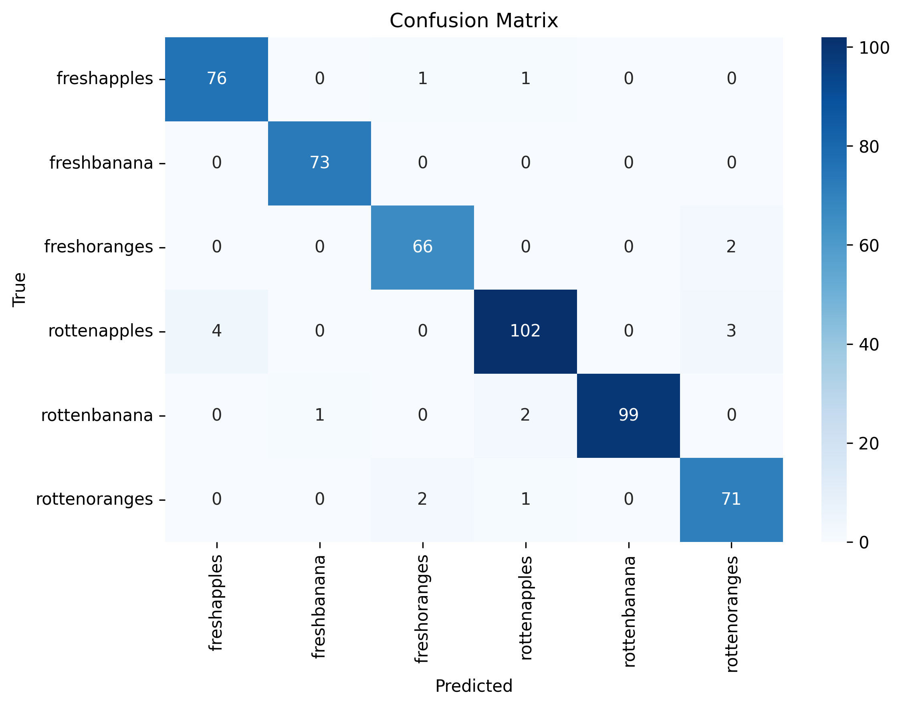
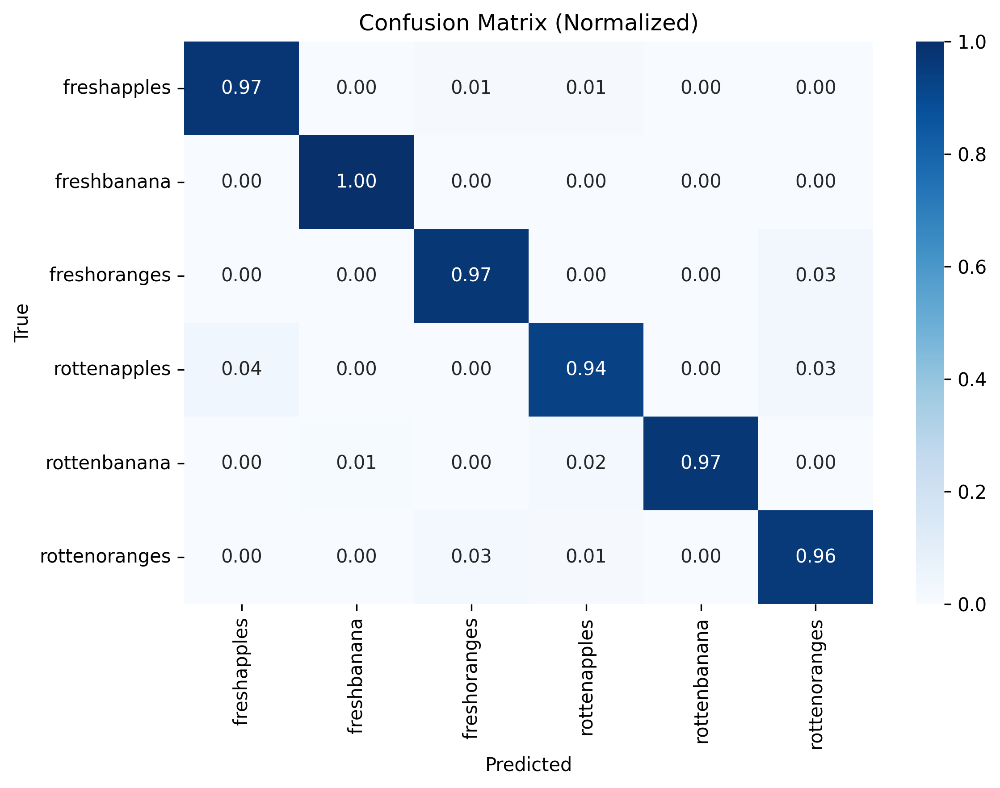

# 🍎🍌 Fruit Classifier

A compact deep learning project for training and deploying a fruit image classifier.  
Trained in PyTorch, evaluated with scikit-learn, and deployed as a web app on **Google Cloud Run**.

---

## ✨ Features
- 📓 End-to-end Jupyter notebook (`fruit_classifier.ipynb`) for training and evaluation  
- 🔬 Confusion matrix & per-class metrics automatically saved to `/images`  
- 🌐 Deployed demo running on **Google Cloud Run**  
- 📦 Reproducible environments with `environment.yml` (Conda) and `requirements.txt` (pip)  
- ⚙️ CI/CD starter pipeline (`cloudbuild.yaml`)  

---

## 🚀 Live Demo
👉 Try the app here:  
**[Fruit Classifier App](https://fruit-classifier-98929583247.europe-west1.run.app)**  

Upload an image of a fruit and get the predicted class in real time. 🍏🍊🍓  

---

## 🗂️ Repository Structure

├── fruit_classifier.ipynb # Main training notebook
├── requirements.txt # pip dependencies
├── environment.yml # conda environment
├── cloudbuild.yaml # optional CI/CD config
├── demo/ # (optional) demo app files
├── images/ # confusion matrices, reports, sample outputs
└── references/ # papers, notes, links

---

## ⚡ Quickstart (Training Locally)

### 1. Clone
```bash
git clone https://github.com/minealsan/fruit_classifier.git
cd fruit_classifier
```

### 2. Set up environment

Conda (recommended):
```bash
conda env create -f environment.yml
conda activate fruit-classifier
```

### 3. Train
```bash
jupyter lab
# open fruit_classifier.ipynb and run all cells
```

## 🧰 Data

Organize your dataset like:

data/
├── train/
│   ├── apple/...
│   ├── banana/...
│   └── ...
├── val/
│   ├── apple/...
│   ├── banana/...
│   └── ...
└── test/
    ├── apple/...
    ├── banana/...
    └── ...


Update dataset paths in the notebook.


## 📊 Results

### Confusion Matrix


### Normalized Confusion Matrix


### Classification Report (example):

| Class | Precision | Recall | F1-score | Support |
|------|----------:|-------:|---------:|--------:|
| freshapples | 0.95 | 0.97 | 0.96 | 78 |
| freshbanana | 0.99 | 1.00 | 0.99 | 73 |
| freshoranges | 0.96 | 0.97 | 0.96 | 68 |
| rottenapples | 0.96 | 0.94 | 0.95 | 109 |
| rottenbanana | 1.00 | 0.97 | 0.99 | 102 |
| rottenoranges | 0.93 | 0.96 | 0.95 | 74 |
| **accuracy** |  |  | **0.97** | 504 |
| macro avg | 0.96 | 0.97 | 0.97 | 504 |
| weighted avg | 0.97 | 0.97 | 0.97 | 504 |

### 📂 Full reports available in images/:

confusion_matrix.png

confusion_matrix_normalized.png

classification_report.txt

classification_report.csv

classification_report.md (paste this table into the README if desired)


## 🖥️ Deployment

This repo is configured for Google Cloud Run deployment:

Build container with Cloud Build

Deploy with Cloud Run

Expose endpoint for predictions

Live endpoint:
👉 https://fruit-classifier-98929583247.europe-west1.run.app

Tip: If you update the container, redeploy your new image to Cloud Run and verify the revision URL.

## 🤝 Contributing

Pull requests welcome! If adding dependencies, update both requirements.txt and environment.yml.

## 🙌 Acknowledgements

- [PyTorch](https://pytorch.org/)  
- [scikit-learn](https://scikit-learn.org/)  
- [Google Cloud Run](https://cloud.google.com/run)  